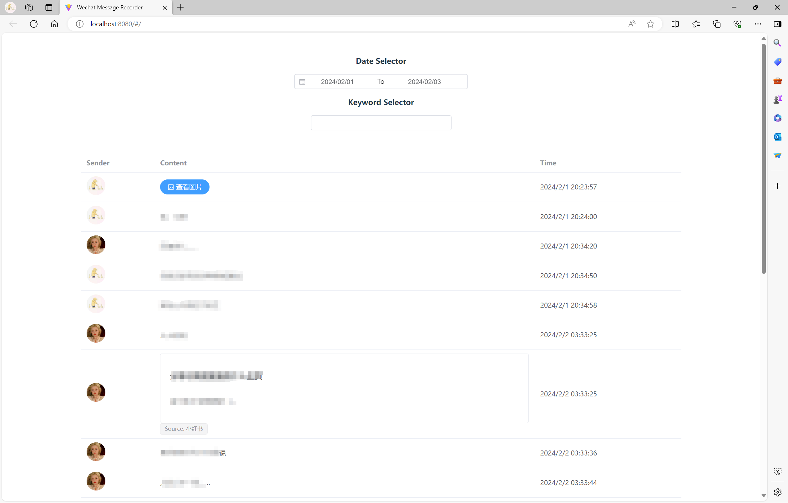
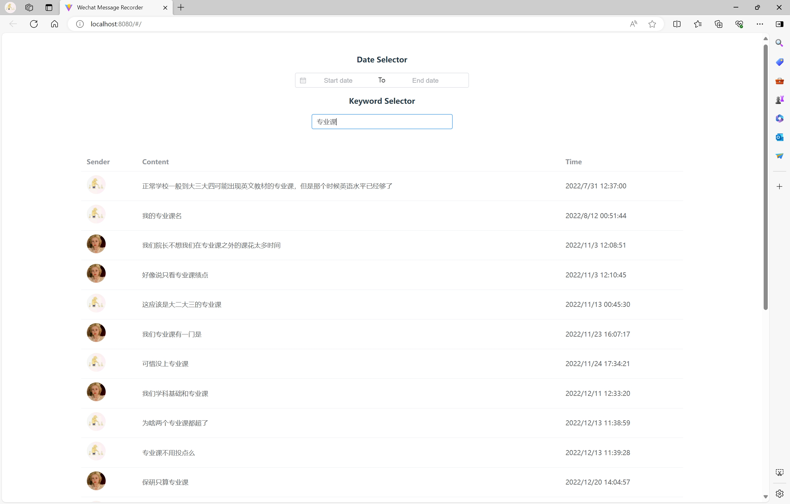
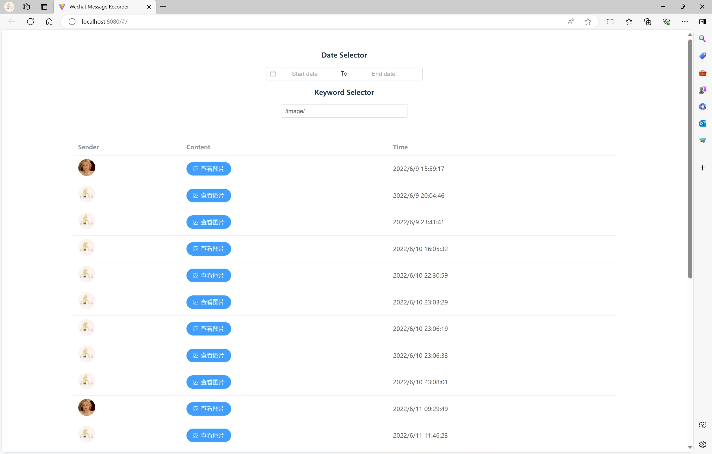

# Wechat-Message-Recorder

This is a Web application that saves WeChat messages on the server and allows for queries in multiple ways.

## Preparation

Export WeChat messages using [WeChatMsg](https://github.com/LC044/WeChatMsg), and try to upload reformatted messages to the MySQL on the server.

A possible struction of MySQL datatable:

```
CREATE TABLE `message` (
  `id` int(11) NOT NULL,
  `type` int(11) NOT NULL,
  `sub_type` int(11) DEFAULT NULL,
  `text` longtext NOT NULL,
  `is_send` int(11) NOT NULL,
  `timestamp` int(11) NOT NULL,
  `url` longtext,
  `title` longtext,
  `description` longtext,
  `app_name` longtext,
  `refer_text` longtext,
  `artist` longtext,
  `link_url` longtext,
  `website_name` longtext
) ENGINE=InnoDB DEFAULT CHARSET=utf8mb4;
```

## Usage

### Required Environment

#### Front-end
Node.js ≥ 18.0

VUE ≥ 3.3

VITE ≥ 5.0

***LATEST:*** vue-axios, vue-router, element-plus *(with @element-plus/icons-vue)*

#### Back-end
Python ≥ 3.9

Flask ≥ 3.0

Flask-CORS ≥ 4.0

Flask-SQLAlchemy ≥ 3.1

PyMySQL ≥ 1.1

### Run Back-end App

Run `./api/python_project/index.py` as a `uWSGI` or `gunicorn` project. 

(Optional) You can bind a domain name to the backend application.

### Run Front-end App

```
npm install
npm run dev
```

## Demo

### Select by date



### Select by keyword



### Select images (using keyword `/image/`)



